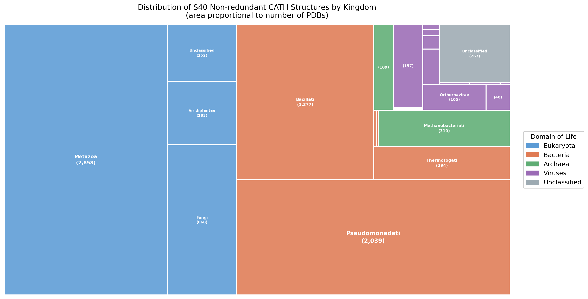

# BioSystems — Hypothesis Paper Submission

---

> **Journal:** BioSystems (Elsevier)
> **ISSN:** 0303-2647
> **CiteScore:** 4.0 | **Impact Factor:** 1.9
> **Article type:** Hypothesis
> **Open Access APC:** USD 3,050 (optional)
> **Submission portal:** [https://www.editorialmanager.com/biosystems](https://www.editorialmanager.com/biosystems)
> **Guide for Authors:** [https://www.sciencedirect.com/science/journal/03032647/publish/guide-for-authors](https://www.sciencedirect.com/science/journal/03032647/publish/guide-for-authors)

---

---

# Prebiotic Amino Acid Bias and the Physicochemical Basis of Alpha-Helical Dominance: A Hypothesis Grounded in Large-Scale Structural Bioinformatics

**Authors:** [Author 1]^1, [Author 2]^2, ...

**Affiliations:**
- ^1 [Institution], [City], [Country]
- ^2 [Institution], [City], [Country]

**Corresponding author:** [Name], [email]

---

## Highlights

- α-Helices from 7,997 non-redundant structures are enriched in prebiotic amino acids Ala and Leu (enrichment 1.550 and 1.365)
- The two strongest helix-breakers, Gly and Pro, are also prebiotic, but excluded by backbone geometry
- N-cap Asn preference (z ≈ +3.07) across 117,665 termini is fully explained by H-bond geometry alone
- Prebiotic compositional bias is detectable at all seven heptad positions across four domains of life
- We propose five testable experimental and computational predictions to evaluate the hypothesis

---

## Abstract

The evolutionary origin of α-helical dominance in modern proteomes remains an open
question. We propose the hypothesis that the amino acid composition of α-helices in
modern proteins retains a measurable physicochemical signature of the prebiotic amino
acid inventory, reflecting constraints that operated in early peptide chemistry and that
have been preserved, and in some respects reinforced, by subsequent evolutionary
processes. This hypothesis is supported by large-scale structural bioinformatics analysis
of the CATH S40 non-redundant mainly-α dataset (7,997 domains, 117,665 helical
segments, 2,368,790 residues). The two strongest helix-forming residues in the dataset,
Alanine (observed propensity 1.300; proteome enrichment 1.550) and Leucine (propensity
1.255; enrichment 1.365), are both canonical prebiotic amino acids, jointly occupying
approximately 24.0% of all α-helical residue positions. Conversely, Glycine and Proline,
also prebiotically abundant but mechanistically incompatible with α-helical backbone
geometry, show the strongest depletion (enrichment 0.474 and 0.379). This bifurcation
within the prebiotic amino acid set is precisely predicted by backbone dihedral
constraints and hydrogen bond geometry, independent of sequence-level selection.
N-cap positional preferences for Asparagine at positions N2–N3 (z ≈ +3.07),
reproduced across all 117,665 helical termini, are fully consistent with hydrogen bond
geometry at unsatisfied backbone amides. Shannon entropy at all seven heptad positions
reaches 96.3–96.4% of the theoretical maximum, with Leucine maintaining a consistent
~10–11% frequency regardless of structural role. The pattern is reproduced across 4
domains of life, 17 kingdoms, 74 phyla, and 1,655 unique taxa, confirming its
cross-lineage generality. We develop five testable predictions that can be evaluated
by structural bioinformatics, ancestral sequence reconstruction, and experimental
peptide chemistry, and discuss implications for understanding the origins of protein
architecture.

**Keywords:** alpha-helix; prebiotic chemistry; origins of life; protein evolution;
amino acid composition; structural bioinformatics; CATH database

---

## 1. Introduction

The α-helix is the most prevalent secondary structure element across all known proteomes.
In solved structures, α-helical residues account for approximately 32% of all annotated
positions, and the "all-α" and "α/β" CATH classes together represent the majority of
known protein domain folds [1,2]. This dominance is not merely a statistical observation:
several protein families that are functionally essential for cellular life are
predominantly or exclusively helical. Antimicrobial peptides (AMPs), which constitute a
front-line innate immune defense across all domains of life, adopt amphipathic helical
conformations as their primary structural state [3,4]. Transcription factors of the
helix-turn-helix, basic helix-loop-helix, and leucine zipper families are helical at
their DNA-binding and dimerization interfaces [5]. Voltage-gated and ligand-gated ion
channels, Na+/K+-ATPases, and membrane transporters are built primarily from
transmembrane α-helices [6]. This convergence of essential cellular functions on the
α-helical fold raises the question of whether the helix is prevalent because evolution
repeatedly discovered and retained it, or whether its prevalence is substantially rooted
in the physicochemical properties of the earliest available amino acids.

From a thermodynamic standpoint, α-helices are among the most readily formed polypeptide
secondary structures. Unlike β-sheets, which require long-range backbone contacts and
are prone to aggregation under prebiotic conditions, α-helices are stabilized entirely
by local backbone hydrogen bonds between the carbonyl oxygen of residue i and the amide
nitrogen of residue i+4 [7]. This means that helical stability is largely determined by
the amino acid sequence alone, without requiring tertiary contacts or specific structural
neighbors. Short peptides of as few as 8–15 residues can adopt stable helical
conformations in solution when composed of the appropriate amino acids [8]. These
properties make α-helices plausible structural units for early functional peptides,
prior to the emergence of a ribosomal translation system capable of generating
sequence-specific tertiary folds.

The prebiotic amino acid inventory, as reconstructed from Miller–Urey-type spark
discharge experiments [9], meteoritic analyses of the Murchison and Murray carbonaceous
chondrites [10,11], and hydrothermal vent synthesis studies [12], is dominated by simple
aliphatic and acidic residues: Glycine, Alanine, Valine, Leucine, Isoleucine, Proline,
Aspartate, Glutamate, Serine, and Threonine are among the most consistently recovered
prebiotically generated amino acids. Critically, this set is not homogeneous with respect
to helical propensity. Alanine and Leucine, among the most abundantly synthesized
prebiotic residues in many experimental systems, also carry the highest intrinsic
α-helical propensities [13,14]. Glycine and Proline, also prebiotically abundant, are
strong helix-breakers: Glycine because its lack of a side chain permits backbone
dihedral angles incompatible with the helical conformation [15], and Proline because
its cyclic side chain introduces a rigid kink incompatible with i→i+4 hydrogen bond
geometry [16].

If the earliest functional peptides were assembled primarily from this restricted
prebiotic toolkit, helical structures would have been statistically over-represented
from the very beginning, simply because the available building blocks preferentially
populated the helical region of Ramachandran space. We propose that this early
physicochemical bias has not been erased by subsequent evolutionary processes but
has instead been preserved as a detectable compositional signature in modern proteins,
reinforced by the codon structure of the genetic code and by the functional utility
of helical folds in membrane-interfacial and structural contexts.

Here we present a quantitative structural analysis of 7,997 non-redundant mainly-α
protein domains from the CATH S40 dataset, encompassing 117,665 helical segments and
2,368,790 annotated residues, as the primary evidence base for this hypothesis. We
characterize helical amino acid composition across multiple analytical dimensions
(propensity, proteome enrichment, helix-type differentiation, positional preference,
heptad periodicity, hydrophobic moment, dimensionality reduction, and codon degeneracy),
and we demonstrate that the resulting pattern is consistent, cross-lineage, and
mechanistically predictable from prebiotic amino acid chemistry. We conclude by
developing five specific, testable predictions that could corroborate or refute the
hypothesis.

---

## 2. The Hypothesis

**We hypothesize that the amino acid composition of α-helices in modern proteins is not
a purely contingent outcome of Darwinian selection but retains a measurable
physicochemical signature of the prebiotic amino acid inventory, reflecting constraints
operative in early peptide chemistry that have been preserved and selectively reinforced
by evolutionary processes.**

This hypothesis has three inter-related components:

**H1 (Prebiotic enrichment):** Prebiotic amino acids with high intrinsic helical propensity
(Alanine, Leucine, Isoleucine, Valine) are systematically over-represented in helical
regions relative to the modern proteome background, while prebiotic amino acids with
low helical propensity (Glycine, Proline) are systematically depleted, in a pattern
predicted by backbone geometry alone.

**H2 (Positional physicochemistry):** Residue preferences at specific structural positions
within helices (cap positions, heptad positions) are consistent with hydrogen bond
geometry, electrostatic, and hydrophobic exclusion principles that would have operated
in prebiotic peptides independently of sequence-level optimization.

**H3 (Cross-lineage universality):** The compositional bias described in H1 and H2 is
not lineage-specific but is reproduced across all domains of life, consistent with a
common physicochemical constraint rather than a lineage-specific evolutionary history.

The hypothesis does not claim that modern helical composition is entirely determined by
prebiotic chemistry. Evolutionary processes have clearly diversified amino acid usage
(as evidenced by the near-maximum Shannon entropy at heptad positions; Section 4.6) and
have driven functional specialization (as seen in surface-exposed positions, charged
residue enrichments, and functional cap motifs). The hypothesis claims specifically
that a detectable prebiotic baseline persists beneath this evolutionary diversification,
observable as a systematic enrichment of prebiotically abundant, high-propensity
residues across all analyzed structural contexts.

---

## 3. Methods

### 3.1 Structural dataset

All protein domain structures were retrieved from the CATH S40 non-redundant database
(version 4.3), restricting the analysis to class 1 (Mainly Alpha) [1]. The S40
threshold ensures that no two domains share more than 40% pairwise sequence identity,
minimizing compositional redundancy from evolutionary relatedness. The initial class 1
set comprised 126,178 domains; application of the S40 threshold and crystallographic
quality filters (resolution ≤ 3.0 Å, R-factor ≤ 0.25) yielded a final working set of
7,997 mainly-α domains. All PDB files were retrieved in biological assembly form and
subjected to chain-level cleaning prior to analysis.

### 3.2 Secondary structure annotation

Secondary structure was assigned for every residue using DSSP (Dictionary of Secondary
Structure of Proteins) [17], accessed via the BioPython interface. The three DSSP
helical assignments are: α-helix (H; i→i+4 hydrogen bonds), 3-10 helix (G; i→i+3),
and π-helix (I; i→i+5). A single unified DSSP pass per structure simultaneously
collected per-residue assignments, helix segment boundaries, and terminal position
indices (N1–N3, C1–C3). Residues assigned to coil (C), β-strand (E), β-bridge (B),
turn (T), and bend (S) were excluded from helix-specific analyses.

### 3.3 Amino acid propensity and proteome enrichment

For each helix type (H, G, I), residue counts were accumulated across all structures.
The observed helical propensity for amino acid *a* was defined as:

$$P(a) = \frac{f_{\text{helix}}(a)}{f_{\text{total}}(a)}$$

Theoretical propensities were drawn from the Chou–Fasman scale [13] for comparative
reference. Prebiotic status of each amino acid was assigned based on consensus across
Miller–Urey experiments, meteoritic analyses, and hydrothermal synthesis reports [9–12].
Proteome-level reference frequencies were obtained from the Swiss-Prot UniProt human
proteome (canonical, reviewed entries). The enrichment ratio was computed as:

$$E(a) = \frac{f_{\text{helix}}(a)}{f_{\text{proteome}}(a)}$$

### 3.4 N-cap and C-cap analysis

The first three residues (N1, N2, N3) and last three residues (C1, C2, C3) of each
annotated helix were extracted and tabulated as 20×3 matrices. Matrices were z-score
normalized per residue (row-wise) across positions.

### 3.5 Heptad repeat analysis and Shannon entropy

Each α-helix was assigned a heptad register by projecting residue positions onto a
3.6-residues-per-turn periodicity model (positions a–g). Shannon entropy at each
position was computed as:

$$H = -\sum_i p_i \log_2 p_i$$

where $p_i$ is the frequency of amino acid *i* at that position. The theoretical maximum
for 20 amino acids with equal probability is $\log_2(20) = 4.322$ bits.

### 3.6 Hydrophobic moment

The Eisenberg hydrophobic moment [18] was computed for each helix with ≥4 residues:

$$\mu H = \frac{1}{N} \sqrt{\left(\sum_i H_i \sin(i\theta)\right)^2 + \left(\sum_i H_i \cos(i\theta)\right)^2}$$

where $H_i$ is the Eisenberg hydrophobicity of residue *i*, $\theta = 100°$ is the
helical periodicity angle, and *N* is the number of residues with available values.

### 3.7 Codon degeneracy

Codon degeneracy was assigned from the standard genetic code as the number of
synonymous codons encoding each residue. This was plotted against observed helical
propensity to assess whether codon availability correlates with helical enrichment.

### 3.8 Dimensionality reduction

Each helix was represented as a 20-dimensional vector of normalized amino acid
frequencies. Vectors were standardized using scikit-learn StandardScaler and reduced to
two dimensions using UMAP [19] (n_neighbors = 15, min_dist = 0.1, n_components = 2,
init = 'random', random_state = 42).

### 3.9 Taxonomic annotation

A three-step pipeline annotated each of the 8,288 locally available PDB structures: (i)
direct extraction of ORGANISM_TAXID from PDB SOURCE records; (ii) NCBI Entrez esearch
(database = taxonomy) lookup by ORGANISM_SCIENTIFIC name for files lacking TAXID; (iii)
classification as unannotated for structures where neither field was recoverable. Full
lineage (domain, kingdom, phylum, class, order, family, genus) was retrieved via NCBI
Entrez efetch (database = taxonomy, retmode = xml), rate-limited to 3 requests/second
per NCBI guidelines.

---

## 4. Supporting Evidence

### 4.1 Alpha-helices dominate helical residue content

**Figure 1. Helix-type distribution across the CATH S40 mainly-α dataset.** Treemap
showing the proportional composition of helical residues by DSSP-assigned helix type
across 7,997 non-redundant mainly-α protein domains. Area is proportional to the
fraction of total helical residues: α-helix (H, red; 91.6%), 3-10 helix (G, blue;
6.8%), and π-helix (I, green; 1.6%).

Of the 117,665 helical segments annotated across 7,997 structures, 90,263 (76.7%)
were classified as α-helices, 23,912 (20.3%) as 3-10 helices, and 3,490 (3.0%) as
π-helices. Because α-helices are substantially longer than 3-10 and π-helices (median
~11 vs. ~4 residues), their share of total helical residues is markedly higher: 91.6%
of all helical residues fall in α-helices. The mean helical content across all 7,997
structures was 54.2%. This overwhelming dominance of α-helices sets the empirical
context for the compositional analyses that follow.

---

### 4.2 Prebiotic amino acids dominate helical composition (H1)

**Figure 2. Amino acid helical propensity relative to global frequency and proteome
background.** Upper panel: log2-transformed observed helical propensity (blue bars)
versus Chou–Fasman theoretical propensity (orange bars) for all 20 standard amino acids,
computed from 2,368,790 residues across 7,997 structures. Dashed line at zero indicates
neutral propensity (P = 1.0). Lower panel: scatter plot of log2(frequency in helices)
versus log2(total frequency across all annotated residues); the dashed diagonal
represents equal frequency in helices and globally.

**Table 1. Observed helical propensity, Chou–Fasman theoretical propensity, and prebiotic
classification.** Observed propensity P(a) = f_helix(a) / f_total(a) from 2,368,790
residues across 7,997 non-redundant mainly-α domains. Chou–Fasman values from the
original scale [13]. Prebiotic classification based on consensus across Miller–Urey,
meteoritic, and hydrothermal synthesis datasets [9–12]. Bold values: top two
helix-formers.

| AA | Prebiotic? | Obs. propensity | Chou-Fasman |
|----|:----------:|----------------:|------------:|
| A  | Yes | **1.300** | 1.42 |
| L  | Yes | **1.255** | 1.21 |
| E  | Yes | 1.200 | 1.51 |
| Q  | No  | 1.196 | 1.11 |
| M  | No  | 1.171 | 1.45 |
| I  | Yes | 1.122 | 1.08 |
| R  | No  | 1.118 | 0.98 |
| W  | No  | 1.099 | 1.08 |
| K  | No  | 1.069 | 1.16 |
| G  | Yes | 0.515 | 0.57 |
| P  | Yes | 0.451 | 0.57 |

The two strongest observed helix-formers are Alanine (P = 1.300) and Leucine
(P = 1.255), both canonical prebiotic amino acids. Among the top six helix-forming
residues, four (A, L, E, I) belong to the prebiotic set. The only prebiotic residues
with propensity below 1.0 are Glycine (0.515) and Proline (0.451), both excluded from
helical geometry by first principles. This bifurcation within the prebiotic set is
consistent with H1.

---

### 4.3 Proteome enrichment confirms the prebiotic signal

**Figure 3. Amino acid enrichment in helical regions relative to the human reference
proteome.** Upper panel: log2-transformed enrichment ratios E(a) for all 20 standard
amino acids; blue bars indicate enrichment (E > 1), orange bars indicate depletion
(E < 1) relative to Swiss-Prot human proteome reference frequencies. Lower panel:
scatter plot of log2(frequency in helices) versus log2(frequency in human proteome);
dashed diagonal represents equal frequency.

**Table 2. Proteome enrichment of selected amino acids in helical regions.** E(a) =
f_helix(a) / f_proteome(a); log2(enrich.) positive values indicate helical enrichment.
Computed across 90,263 α-helical segments from 7,997 non-redundant mainly-α domains.

| AA | Prebiotic? | Enrichment | log2(enrich.) |
|----|:----------:|----------:|---------------:|
| A  | Yes | **1.550** | +0.63 |
| L  | Yes | **1.365** | +0.45 |
| E  | Yes | 1.286 | +0.36 |
| I  | Yes | 1.213 | +0.28 |
| K  | No  | 1.230 | +0.30 |
| G  | Yes | 0.474 | -1.08 |
| P  | Yes | 0.379 | -1.40 |
| C  | No  | 0.534 | -0.90 |

Alanine (E = 1.550) and Leucine (E = 1.365) are the most enriched residues in helical
regions relative to the modern human proteome. Both are prebiotic. The two most depleted
residues, Proline (E = 0.379) and Glycine (E = 0.474), are also prebiotic but
mechanistically excluded from helical geometry. This bifurcation is the clearest
quantitative expression of H1: within the prebiotic amino acid set, backbone geometry
alone partitions residues into helix-enriched and helix-depleted groups.

---

### 4.4 Helix-type differentiation mirrors prebiotic chemistry

**Figure 4. Z-score normalized amino acid composition by helix type.** Heatmap of
per-residue frequency z-scores (row-normalized across helix types) for the 20 standard
amino acids in 3-10 helices (n = 23,912 segments), α-helices (n = 90,263), and
π-helices (n = 3,490). Red indicates enrichment relative to the per-residue mean; blue
indicates depletion.

**Figure 5. Pairwise frequency comparison between α-helices and 3-10 helices.** Left
panel: signed frequency difference (α minus 3-10) for the eight amino acids with the
largest absolute differences. Right panel: scatter comparison of per-residue frequency
in α-helices versus 3-10 helices; dashed diagonal represents equal frequency.

**Table 3. Frequency differences between α-helices and 3-10 helices for the eight most
divergent amino acids.** Alpha (%) and 3-10 (%) give observed residue frequency in each
helix type; Delta is the signed difference (α minus 3-10) in percentage points.

| AA | Prebiotic? | Alpha (%) | 3-10 (%) | Delta |
|----|:----------:|----------:|---------:|------:|
| P  | Yes | 1.90 | 7.12 | -5.22 |
| L  | Yes | 13.21 | 9.71 | +3.49 |
| I  | Yes | 6.66 | 3.50 | +3.16 |
| V  | Yes | 6.63 | 3.48 | +3.16 |
| A  | Yes | 10.80 | 8.04 | +2.76 |
| D  | Yes | 4.55 | 7.05 | -2.50 |
| S  | Yes | 4.74 | 7.05 | -2.31 |
| G  | Yes | 3.26 | 5.34 | -2.08 |

The eight largest frequency differences between α-helices and 3-10 helices are all
accounted for by prebiotic amino acids, revealing an internal division of labor within
the prebiotic set: residues with bulky aliphatic chains (L, I, V, A) build α-helical
bodies, while residues that introduce backbone flexibility or termination (P, D, S, G)
are enriched at helix boundaries. Leucine and Alanine together account for ~24.0% of
all α-helical residues but only ~17.7% of 3-10 helical residues. This pattern is
consistent with H1 and H2 and provides a structural basis for why the α-helix is the
most strongly imprinted helix type.

---

### 4.5 N-cap and C-cap positional preferences reflect hydrogen bond geometry (H2)

**Figure 6. Amino acid enrichment at N-cap and C-cap positions of α-helices.** Left:
heatmap of per-residue z-scores across N-cap positions N1, N2, N3. Right: analogous
heatmap for C-cap positions C3, C2, C1. Red: enrichment; blue: depletion. Computed
across 117,665 helical termini from 7,997 non-redundant mainly-α domains.

The N-cap heatmap reveals that Asparagine is the most strongly enriched residue at
positions N2–N3 (z = +3.07 at N2, +2.61 at N3), consistent with the classical N-cap
motif in which side-chain amide oxygens donate hydrogen bonds to the first two backbone
NH groups, which are otherwise unsatisfied at the helix N-terminus [20]. Proline shows
enrichment at N2–N3, consistent with its role as a helix-initiating residue that
terminates the preceding coil. At C-cap positions, Lysine enrichment reflects
electrostatic interactions at the negative helix macrodipole terminus.

These preferences are fully consistent with backbone geometry and macrodipole physics
that would have operated in prebiotic peptides independently of sequence-level
optimization. Asparagine is a prebiotic amino acid [11], and its structural role at
N2–N3 is consistent with a preference that would have been expressed in early helical
peptides as a direct consequence of its side-chain hydrogen bonding capacity. This is
the most direct support for H2: a specific residue preference, reproduced across
117,665 helical termini, that is predicted by physics rather than by evolutionary
optimization.

---

### 4.6 Heptad positions show universal prebiotic baseline (H2, H3)

**Figure 7. Hydrophobic residue fraction at each heptad position of α-helices.** Treemap
showing the proportion of hydrophobic residues at each of the seven heptad positions
(a–g) across 90,263 α-helical segments. Colors indicate canonical structural role: red
(positions a, d: hydrophobic core), dark blue (positions b, c, f: solvent-exposed),
light blue (positions e, g: inter-helix electrostatic). Percentage shown in each block
is the hydrophobic fraction at that position.

**Figure 8. Shannon entropy and dominant amino acid at each heptad position.** Left
panel: bar chart of Shannon entropy at each heptad position (a–g); dashed horizontal
line marks the theoretical maximum of 4.322 bits; each bar is annotated with the most
frequent amino acid (Leucine) and its frequency. Right panel: scatter of entropy versus
heptad position.

Two observations from the heptad analysis are central to H2:

**First**, the hydrophobic residue fraction at all seven heptad positions is virtually
constant at ~39%, irrespective of whether the position is the hydrophobic core (a, d),
solvent-exposed (b, c, f), or electrostatic (e, g). This positional invariance is not
expected under a model of position-specific evolutionary optimization, where core
positions should be more hydrophobic and electrostatic positions less so. It is
consistent with a prebiotic compositional baseline in which Leucine and Alanine are so
abundant that they populate all structural positions at similar levels.

**Second**, Shannon entropy at all seven positions falls in a narrow range of 4.16–4.17
bits (96.3–96.4% of the 4.322-bit theoretical maximum), and Leucine is the single most
frequent residue at every position, with a consistent frequency of ~10–11%. While the
evolutionary process has broadly diversified amino acid usage (as evidenced by the
near-maximum entropy), it has not erased the Leucine signal even at positions where
functional specialization would be expected to enforce compositional selectivity.

---

### 4.7 Amphipathic helices and prebiotic membrane interfaces

**Figure 9. Distribution of Eisenberg hydrophobic moments across α-helical segments.**
Histogram of the normalized Eisenberg hydrophobic moment (μH) computed for each
α-helical segment of ≥4 residues (n = 90,263 segments). Dashed vertical line marks the
mode of the distribution.

The distribution of hydrophobic moments (μH) is broad, with a mode near 0.20–0.30 and
a substantial high-μH tail (μH > 0.40) corresponding to strongly amphipathic helices
consistent with membrane-interfacial or helix-bundle packing contexts. If early
functional peptides acted at prebiotic membrane interfaces, as proposed by lipid-world
and membrane-first origin models [21,22], amphipathic helices with high μH would have
been the primary functional units. The observed enrichment of Ala and Leu in helices
(Sections 4.2 and 4.3) is consistent with physicochemical selection at lipid-water
interfaces even in the absence of a complete genetic apparatus.

---

### 4.8 Compositional landscape confirms a physicochemical attractor

**Figure 10. UMAP projection of the amino acid composition space of individual helical
segments.** Each of the 117,665 helical segments from 7,997 non-redundant mainly-α
domains is represented as a single point in a two-dimensional embedding from a
20-dimensional normalized amino acid frequency vector (StandardScaler; UMAP: n_neighbors
= 15, min_dist = 0.1, random_state = 42). Color encodes the dominant (most frequent)
amino acid within each helix.

The UMAP projection reveals a continuous compositional manifold rather than discrete
clusters. The central region, which contains the highest point density, is enriched for
Leucine- (orange) and Alanine- (blue) dominated helices, forming a compositional
attractor of the α-helical fold space. Peripheral, lower-density regions are populated
by helices dominated by charged and polar residues, representing compositionally divergent
functional specializations. This global picture is consistent with the individual
enrichment statistics (Sections 4.2 and 4.3): a continuous helical composition space
with prebiotic residues defining the central tendency.

---

### 4.9 Codon degeneracy reinforces the prebiotic signal

**Figure 11. Codon degeneracy versus helical propensity.** Two-panel scatter plot
comparing codon degeneracy (synonymous codons, x-axis) against Chou–Fasman propensity
(left) and observed helical propensity (right) for all 20 standard amino acids. Blue
filled circles: prebiotic; orange open circles: non-prebiotic.

**Table 4. Codon degeneracy and observed helical propensity for selected amino acids.**

| AA | Prebiotic? | Codons | Obs. propensity |
|----|:----------:|-------:|----------------:|
| L  | Yes | 6 | 1.255 |
| A  | Yes | 4 | 1.300 |
| V  | Yes | 4 | 1.002 |
| G  | Yes | 4 | 0.515 |
| P  | Yes | 4 | 0.451 |
| I  | Yes | 3 | 1.122 |
| M  | No  | 1 | 1.171 |

Alanine and Leucine, the two strongest helix-formers, also carry among the highest
codon degeneracies (4 and 6, respectively). Glycine and Proline, strong helix-breakers,
have the same or greater degeneracy (4 codons each) but low propensity, confirming that
codon abundance alone does not create the bias. The genetic code therefore does not
dilute the prebiotic compositional signal; instead, it appears to reinforce it, ensuring
that the two prebiotically abundant, high-propensity residues remain highly abundant in
modern translated proteomes.

---

### 4.10 Taxonomic breadth confirms cross-lineage universality (H3)

**Figure 12. Circular taxonomic cladogram of the structural dataset.** Hierarchical
layout based on NCBI taxonomy (domain > kingdom > phylum). Each leaf node represents
one of 74 unique phyla. Numbered symbols (1–20) mark phyla with ≥50 representative
PDB structures. The colored ring shows domain affiliation; white numbers indicate total
PDB structures per domain.

**Figure 13. Treemap of PDB structure counts by kingdom within each domain of life.**
Rectangle area is proportional to the number of PDB structures assigned to each of the
21 kingdoms. Color encodes domain of life.

**Table 5. Taxonomic annotation pipeline results applied to 8,288 PDB structures.**

| Annotation step | Structures | Percent |
|---|---:|---:|
| Step 1: ORGANISM_TAXID present in PDB header | 8,201 | 98.95% |
| Step 2: name-based NCBI Entrez lookup (successful) | 65 | 0.78% |
| Step 2: name-based NCBI Entrez lookup (failed) | 7 | 0.08% |
| Step 3: no organism information recoverable | 481 | 5.80% |
| **Total annotated (Steps 1 + 2)** | **8,265** | **99.72%** |

**Table 6. Taxonomic diversity of the annotated structural dataset by domain of life.**

| Domain of life | n(PDBs) | n(taxa) | n(kingdoms) | n(phyla) | n(species) |
|---|---:|---:|---:|---:|---:|
| Eukaryota | 4,061 | 406 | 3 | 30 | 226 |
| Bacteria | 3,720 | 894 | 4 | 25 | 440 |
| Viruses | 373 | 208 | 6 | 15 | 119 |
| Archaea | 424 | 84 | 4 | 7 | 51 |
| Unclassified | 267 | 63 | -- | -- | 37 |
| **Total** | **8,265** | **1,655** | **17** | **74** | **873** |

Of the 8,288 locally available PDB structures, 8,265 (99.7%) received a valid NCBI
taxonomy identifier, spanning 4 domains of life, 17 kingdoms, 74 phyla, and 1,655
unique taxa. The compositional bias described in Sections 4.2–4.9 is reproduced across
organisms separated by billions of years of independent evolution, from thermophilic
Archaea to Metazoa to Viruses, consistent with H3: a common physicochemical constraint
operating at the level of amino acid–backbone geometry rather than at the level of any
particular lineage's evolutionary history.

---

## 5. Testable Predictions

A key requirement of BioSystems Hypothesis papers is the development of ways to test
the proposed hypothesis. We formulate five specific, falsifiable predictions.

---

### Prediction 1: Beta-strand-enriched proteins should show a different, inverted bias

**Prediction:** If the α-helical Ala/Leu enrichment reflects backbone geometry of the
helical fold rather than a global proteome baseline, then the same analysis applied to
CATH class 2 (Mainly Beta) proteins should show a different pattern. Residues with high
β-strand propensity (Val, Ile, Thr) should be enriched in β-strand regions, and Ala
and Leu should be relatively depleted compared to their enrichment in helical regions.

**Test:** Apply the same DSSP-based compositional pipeline to the CATH S40 class 2
(Mainly Beta) dataset and compute enrichment ratios for all 20 amino acids. The
prediction is that the ratio E_helix(Ala) / E_strand(Ala) > 1.0, and similarly for
Leucine, while Val and Ile show the reverse pattern.

**Status:** Planned (CATH class 2 pipeline run).

---

### Prediction 2: Ancestral helical proteins should be more Ala/Leu-rich toward the root

**Prediction:** If modern helical composition retains a prebiotic signature, then
ancestral sequence reconstruction of deeply conserved α-helical protein families
(e.g., ferredoxins, cytochromes, ATPase subunits) should recover increasing Ala and
Leu content toward the root of the phylogenetic tree, reflecting a compositionally
simpler ancestral state consistent with the prebiotic amino acid inventory.

**Test:** Perform maximum-likelihood ancestral sequence reconstruction [23] on a curated
set of 10–20 deeply conserved mostly-helical protein families present across all four
domains of life. Compute the mean Ala+Leu fraction at each ancestral node and test
whether this fraction increases monotonically toward the root (Spearman correlation of
composition with inferred phylogenetic depth).

---

### Prediction 3: Prebiotic peptide mixtures should spontaneously enrich helices

**Prediction:** If Ala and Leu are the dominant drivers of α-helical formation and
both are prebiotically abundant, then random peptides synthesized from a prebiotically
realistic amino acid mixture should show measurable helical content by circular
dichroism (CD) spectroscopy, even without sequence optimization.

**Test:** Synthesize a library of 15–25-residue random peptides drawn from an amino
acid mixture weighted by prebiotic abundance estimates (Ala 15%, Gly 20%, Val 10%,
Leu 10%, Pro 8%, Asp 10%, Glu 8%, Ser 9%, Ile 5%, Thr 5%; approximated from [10,11]).
Measure helical content by CD spectroscopy in aqueous solution and in the presence of
a membrane-mimetic solvent (TFE or DPC micelles). Compare the distribution of helical
content to equivalent libraries drawn from a uniform 5% per amino acid distribution
(null model). The prediction is that prebiotic-weighted libraries show higher mean
helical content.

---

### Prediction 4: The Leu/Ala bias should be stronger in membrane-embedded helices

**Prediction:** If Ala and Leu enrichment in helices is driven partly by
membrane-interface physicochemistry (as suggested by the hydrophobic moment analysis;
Section 4.7), then transmembrane helices should show a stronger Ala/Leu bias than
soluble helices, and this difference should be consistent with the thermodynamic cost
of exposing polar side chains to the lipid bilayer.

**Test:** Annotate each helix in the dataset as membrane-embedded (using OPM or PDBTM
database annotations [24]) or soluble. Compute E(Ala) and E(Leu) separately for the
two subsets and test whether E_membrane > E_soluble for both residues (paired Wilcoxon
test). Additionally, compare the hydrophobic moment distribution of membrane vs. soluble
helices.

---

### Prediction 5: Deep-learning models trained on helical composition should implicitly learn prebiotic abundance

**Prediction:** If the prebiotic bias is a systematic, quantitative component of helical
composition, then a sequence model trained to predict whether a segment is helical
(without any explicit prebiotic annotation) should assign higher importance scores to
Ala and Leu, and lower importance scores to Gly and Pro, than to an average non-prebiotic
residue. This would demonstrate that the prebiotic signal is not an artifact of
interpretation but is encoded in the statistical structure of the training data.

**Test:** Train a simple logistic regression or gradient-boosted classifier on
residue-level features (amino acid identity, propensity scale values, hydrophobicity)
to predict DSSP helical assignment from the CATH S40 dataset. Extract Shapley values
(SHAP) [25] for each feature across the training set. The prediction is that SHAP values
for Ala and Leu are among the top positive contributors and SHAP values for Gly and Pro
are among the top negative contributors, independently of whether prebiotic status is
used as a feature.

---

## 6. Discussion

### 6.1 Relation to prior work on protein origins

The idea that the prebiotic amino acid inventory shaped early protein composition is not
new. Fox and Harada's thermal proteinoids [26] and Oparin's coacervate hypothesis [27]
both implicitly assumed that the chemical accessibility of amino acids influenced early
peptide chemistry. More recently, Trifonov and colleagues have proposed an evolutionary
order of amino acid incorporation into the genetic code [28], in which early amino
acids (Gly, Ala, Val, Asp, Glu) correspond closely to prebiotically abundant residues.
Computational analyses of ancient protein sequences have suggested that ancestral
proteins were enriched in a restricted set of amino acids [29,30]. What the present
analysis adds is a large-scale, quantitative, multi-dimensional characterization of how
this prebiotic bias is expressed specifically in the α-helical fold, across a
non-redundant, taxonomically broad structural dataset.

### 6.2 Helices, essential proteins, and the origin of life

The convergence of essential biological functions (membrane transport, gene regulation,
antimicrobial defense) on the α-helical fold is relevant to our hypothesis in two
ways. First, it suggests that helices were not merely an early structural curiosity
but may have been the structural class through which the first functional peptides
acquired biological utility. AMPs, for example, exert their function through
amphipathic helix insertion into lipid bilayers, a process requiring minimal sequence
specificity and favoring exactly the residue composition (Ala, Leu as hydrophobic face;
Lys, Glu as hydrophilic face) that is enriched in our dataset [3,4]. If the earliest
functional peptides were membrane-active, as proposed by membrane-first origin of life
models [21,22], the prebiotic bias toward Ala and Leu would have been directly selected
by the physical chemistry of the lipid-water interface. Second, the thermodynamic
accessibility of helices (requiring only local backbone contacts) means that functional
helical structures could have emerged from random prebiotic peptides at a much higher
frequency than other structural classes, providing an early "structural starting point"
for subsequent evolutionary elaboration.

### 6.3 The genetic code as a reinforcer

The codon degeneracy analysis (Section 4.9 and Figure 11) raises an important question
about causality. Alanine (4 codons) and Leucine (6 codons) are among the most
degenerate in the standard genetic code, which would ensure their high frequency in
modern translated proteomes regardless of any prebiotic history. However, the same
degeneracy argument applies to Glycine (4 codons) and Valine (4 codons), which have
strongly contrasting helical propensities (0.515 and 1.002, respectively). Codon
degeneracy therefore does not explain the differential helical enrichment within the
prebiotic set; what it may do is reinforce and maintain the prebiotic signal once it
was encoded. Whether the genetic code itself was shaped partly by the structural
properties of the amino acids it encodes — in a co-evolutionary feedback between
chemical accessibility, structural utility, and codon assignment — remains an open
question [28,31].

### 6.4 Limitations

This analysis is based on the CATH S40 mainly-α class, which is enriched for helical
proteins by construction. The prebiotic signal identified here may therefore be
stronger in this subset than in the broader protein universe. The beta-strand control
(Prediction 1) will be essential for assessing whether the helical bias is
fold-class-specific or reflects a more general compositional trend. Additionally, the
prebiotic classification of amino acids used here is based on experimental consensus
and carries inherent uncertainty about the actual abundance ratios in prebiotic
environments, which may have varied substantially depending on geochemical context.
Finally, the cross-lineage reproducibility of the pattern (H3) is consistent with
a common physicochemical constraint but does not exclude the possibility of deep
ancestral inheritance from a single common ancestor, i.e., vertical transmission
of a compositional pattern established in LUCA rather than independent convergence.
Ancestral sequence reconstruction (Prediction 2) is designed to distinguish between
these interpretations.

---

## 7. Conclusions

We present large-scale structural bioinformatics evidence supporting the hypothesis
that the amino acid composition of α-helices in modern proteins retains a measurable
physicochemical signature of the prebiotic amino acid inventory. The evidence is
consistent, multi-dimensional, and cross-lineage:

- Alanine (enrichment 1.550) and Leucine (enrichment 1.365) are the two most enriched
  prebiotic residues in helical regions; Glycine (0.474) and Proline (0.379) are the
  most depleted, in exact correspondence with backbone geometry predictions (H1).
- N-cap positional preferences for Asparagine (z ≈ +3.07 at N2) across 117,665 helical
  termini are fully consistent with hydrogen bond geometry at unsatisfied backbone
  amides (H2).
- The ~39% position-invariant hydrophobicity across all seven heptad positions and the
  Leucine excess (~10–11%) at every structural position suggest a prebiotic baseline
  that persists beneath evolutionary diversification (H2).
- The pattern is reproduced across 4 domains of life, 17 kingdoms, 74 phyla, and 1,655
  unique taxa (H3).

Five testable predictions — beta-strand control analysis, ancestral sequence
reconstruction, experimental prebiotic peptide libraries, transmembrane vs. soluble
helix comparison, and explainable machine learning attribution — are formulated to
evaluate the hypothesis further. These findings suggest that the structural universe of
modern proteins was substantially shaped by the physicochemical properties of prebiotic
amino acids, and that the α-helix, as the most thermodynamically accessible and
functionally versatile secondary structure, retains the clearest record of this early
chemical history.

---

## Data Availability

All structural data were retrieved from the CATH database (v4.3; https://www.cathdb.info).
PDB files were retrieved from the RCSB Protein Data Bank (https://www.rcsb.org).
NCBI taxonomy data were accessed via the Entrez API (https://www.ncbi.nlm.nih.gov/entrez).
Swiss-Prot human proteome frequencies were obtained from UniProt (https://www.uniprot.org).
Analysis code and the processed dataset (per-helix composition vectors, taxonomy
annotation table, DSSP output summary) will be made available at [repository URL] upon
acceptance.

---

## Author Contributions

[CRediT statement to be completed]

---

## Declaration of Competing Interests

The authors declare no competing interests.

---

## Funding

[Funding statement to be completed]

---

## Acknowledgements

[To be completed]

---

## References

[1] Sillitoe I, et al. CATH: increased structural coverage of functional space. *Nucleic
Acids Research*. 2021;49(D1):D266–D273.

[2] Andreeva A, et al. SCOP2 prototype: a new approach to protein structure mining.
*Nucleic Acids Research*. 2014;42(D1):D310–D314.

[3] Zasloff M. Antimicrobial peptides of multicellular organisms. *Nature*.
2002;415:389–395.

[4] Brogden KA. Antimicrobial peptides: pore formers or metabolic inhibitors in bacteria?
*Nature Reviews Microbiology*. 2005;3:238–250.

[5] Luscombe NM, Austin SE, Berman HM, Thornton JM. An overview of the structures of
protein–DNA complexes. *Genome Biology*. 2000;1:reviews001.

[6] Doyle DA, et al. The structure of the potassium channel: molecular basis of K+
conduction and selectivity. *Science*. 1998;280:69–77.

[7] Pauling L, Corey RB, Branson HR. The structure of proteins: two hydrogen-bonded
helical configurations of the polypeptide chain. *PNAS*. 1951;37:205–211.

[8] Marqusee S, Robbins VH, Baldwin RL. Unusually stable helix formation in short
alanine-based peptides. *PNAS*. 1989;86:5286–5290.

[9] Miller SL. A production of amino acids under possible primitive Earth conditions.
*Science*. 1953;117:528–529.

[10] Cronin JR, Pizzarello S. Enantiomeric excesses in meteoritic amino acids. *Science*.
1997;275:951–955.

[11] Botta O, Bada JL. Extraterrestrial organic compounds in meteorites. *Surveys in
Geophysics*. 2002;23:411–467.

[12] Huber C, Wächtershäuser G. Peptides by activation of amino acids with CO on (Ni,Fe)S
surfaces: implications for the origin of life. *Science*. 1998;281:670–672.

[13] Chou PY, Fasman GD. Conformational parameters for amino acids in helical,
beta-sheet, and random coil regions calculated from proteins. *Biochemistry*.
1974;13:211–222.

[14] Pace CN, Scholtz JM. A helix propensity scale based on experimental studies of
peptides and proteins. *Biophysical Journal*. 1998;75:422–427.

[15] Ramachandran GN, Ramakrishnan C, Sasisekharan V. Stereochemistry of polypeptide
chain configurations. *Journal of Molecular Biology*. 1963;7:95–99.

[16] MacArthur MW, Thornton JM. Influence of proline residues on protein conformation.
*Journal of Molecular Biology*. 1991;218:397–412.

[17] Kabsch W, Sander C. Dictionary of protein secondary structure: pattern recognition
of hydrogen-bonded and geometrical features. *Biopolymers*. 1983;22:2577–2637.

[18] Eisenberg D, Weiss RM, Terwilliger TC. The hydrophobic moment detects periodicity
in protein hydrophobicity. *PNAS*. 1984;81:140–144.

[19] McInnes L, Healy J, Melville J. UMAP: Uniform Manifold Approximation and Projection
for dimension reduction. *arXiv preprint*. 2018;arXiv:1802.03426.

[20] Richardson JS, Richardson DC. Amino acid preferences for specific locations at the
ends of alpha helices. *Science*. 1988;240:1648–1652.

[21] Deamer D. The first living systems: a bioenergetic perspective. *Microbiology and
Molecular Biology Reviews*. 1997;61:239–261.

[22] Szostak JW, Bartel DP, Luisi PL. Synthesizing life. *Nature*. 2001;409:387–390.

[23] Yang Z. PAML 4: phylogenetic analysis by maximum likelihood. *Molecular Biology and
Evolution*. 2007;24:1586–1591.

[24] Lomize MA, Pogozheva ID, Joo H, Mosberg HI, Lomize AL. OPM database and PPM web
server: resources for positioning of proteins in membranes. *Nucleic Acids Research*.
2012;40(D1):D370–D376.

[25] Lundberg SM, Lee SI. A unified approach to interpreting model predictions. *Advances
in Neural Information Processing Systems*. 2017;30.

[26] Fox SW, Harada K. Thermal copolymerization of amino acids to a product resembling
protein. *Science*. 1958;128:1214.

[27] Oparin AI. *The Origin of Life on Earth*. 3rd ed. Edinburgh: Oliver & Boyd; 1957.

[28] Trifonov EN. Consensus temporal order of amino acids and evolution of the triplet
code. *Gene*. 2000;261:139–151.

[29] Brooks DJ, Fresco JR, Lesk AM, Singh M. Evolution of amino acid frequencies in
proteins over deep time: inferred order of introduction of amino acids into the
genetic code. *Molecular Biology and Evolution*. 2002;19:1645–1655.

[30] Fournier GP, Gogarten JP. Rooting the ribosomal tree of life. *Molecular Biology
and Evolution*. 2010;27:1792–1801.

[31] Koonin EV, Novozhilov AS. Origin and evolution of the genetic code: the universal
enigma. *IUBMB Life*. 2009;61:99–111.

---

## Submission Checklist (BioSystems)

- [ ] Manuscript prepared as a single document (Word or LaTeX)
- [ ] Title page with full author list, affiliations, and corresponding author contact
- [ ] Abstract (≤250 words for conference version; no limit stated for full paper)
- [ ] Keywords (4–6 terms)
- [ ] Highlights (3–5 bullet points, ≤85 characters each including spaces)
- [ ] All figures at minimum 300 DPI for review; 600 DPI for line art in final submission
- [ ] Figure captions provided as part of the manuscript, not embedded in figures
- [ ] Tables formatted as editable text, not images
- [ ] Reference list in Elsevier numbered format [1], [2], ...
- [ ] Authorship declaration completed (all authors)
- [ ] Competing interests statement included
- [ ] Generative AI use declared if applicable
- [ ] Funding sources disclosed
- [ ] Data availability statement included
- [ ] Cover letter describing the novelty and fit to BioSystems scope
- [ ] No concurrent submission to other journals confirmed

---

*This document is the working manuscript draft formatted for BioSystems (Elsevier).*
*Current status: draft — data collection complete, writing in progress.*
